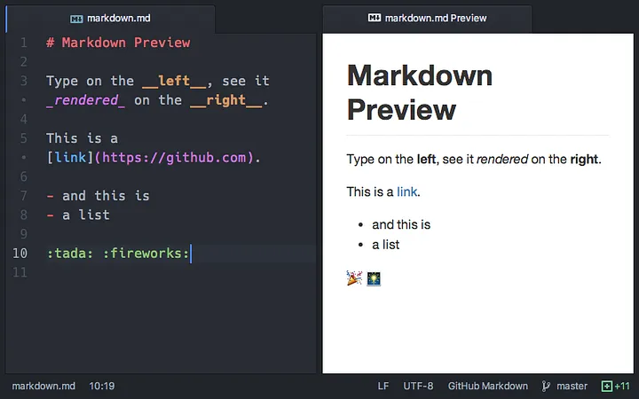
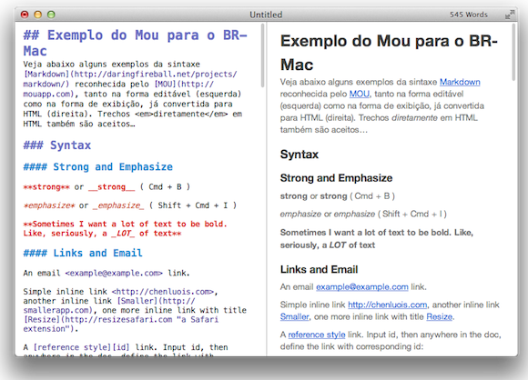
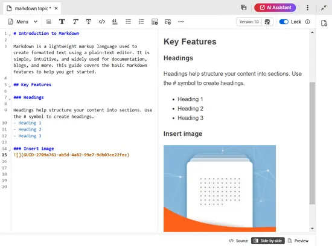

### **1. O que é Markdown?**

É uma linguagem de marcação leve que permite formatar texto usando símbolos simples do teclado.

- **Onde é usado?**
    
    - Arquivos README (em projetos de programação)
        
    - Documentação de software
        
    - Blogs e sites (para escrever posts)
        
    - Anotações rápidas
        
    - Comunicação em plataformas como GitHub, GitLab, Slack, Discord, entre outras.

- **Títulos (Headers):** Use `#` para diferentes níveis de títulos.
    
    Markdown
    
    ```
    # Título Nível 1
    ## Título Nível 2
    ### Título Nível 3
    #### Título Nível 4
    ##### Título Nível 5
    ###### Título Nível 6
    ```
    
- **Parágrafos:** Apenas digite o texto. Uma linha em branco separa parágrafos.
    
- **Ênfase (Negrito e Itálico):**
    
    - Negrito: `**texto em negrito**` ou `__texto em negrito__`
        
    - Itálico: `*texto em itálico*` ou `_texto em itálico_`
        
    - Negrito e Itálico: `***texto em negrito e itálico***`
        
- **Listas:**
    
    - **Não Ordenadas (Bullet Points):** Use `*`, `-` ou `+`.
        
        Markdown
        
        ```
        * Item 1
        * Item 2
            * Subitem 2.1
            * Subitem 2.2
        ```
        
    - **Ordenadas (Numeradas):** Use números seguidos de um ponto.
        
        Markdown
        
        ```
        1. Primeiro item
        2. Segundo item
        3. Terceiro item
        ```
        
- **Links:** `[Texto do Link](URL do Link)`
    
    Markdown
    
    ```
    [Visite o Google](https://www.google.com)
    ```
    
- **Imagens:** ``
    
    Markdown
    
    ```
    
    ```
    
    _Obs: Para imagens locais, apenas o caminho do arquivo._
    
- **Blocos de Código (Code Blocks):** Use três crases (``````) antes e depois do código para blocos inteiros, e uma crase (`` ` ``) para trechos inline.
    
    Markdown
    
    ````
    `print("Olá, mundo!")` é um código inline.
    
    ```python
    def saudacao(nome):
        return f"Olá, {nome}!"
    print(saudacao("Colegas"))
    ````
    
    ```
    *Dica: Podem especificar a linguagem após as três crases para destaque de sintaxe.*
    
    ```
    
- **Citações (Blockquotes):** Use `>`.
    
    Markdown
    
    ```
    > "A simplicidade é o último grau de sofisticação."
    > - Leonardo da Vinci
    ```
    
- **Linha Horizontal (Thematic Breaks):** Use três ou mais `---`, `***` ou `___`.
    
    Markdown
    
    ```
    ---
    ```
    
- **Tabela**

    ```
    | Nome     | Idade | Cidade     |
    |----------|-------|------------|
    | Ana      | 23    | São Paulo  |
    | Bruno    | 31    | Recife     |
    ```

    | Nome     | Idade | Cidade     |
    |----------|-------|------------|
    | Ana      | 23    | São Paulo  |
    | Bruno    | 31    | Recife     |


- **Checkbox**

    ```
    - [x] Preparar apresentação
    - [ ] Revisar exemplos
    - [ ] Compartilhar material
    ```

    - [x] Preparar apresentação
    - [ ] Revisar exemplos
    - [ ] Compartilhar material

- **Referências**

    ```
    Markdown é muito útil para documentação.[^1]

    [^1]: Especialmente em projetos colaborativos.
    ```

    Markdown é muito útil para documentação.[^1]

    [^1]: Especialmente em projetos colaborativos.

- **Emoji**

    ```
    Parabéns pelo trabalho! :tada: :rocket:
    ```

    Parabéns pelo trabalho! :tada: :rocket:


---

### **4. Ferramentas e Recursos Úteis**

- **Editores de Texto:**
    
    - **VS Code:** Com extensões como "Markdown All in One" e "Markdown Preview Enhanced".
        
    - **Typora:** Editor focado na experiência de escrita Markdown.
        
    - **Obsidian:** Para gestão de notas e conhecimento, usa Markdown.
        
    - **Online:** Dillinger, StackEdit.
        
- **Plataformas que usam Markdown:** GitHub, GitLab, Stack Overflow, Reddit, Discord, Slack.
    
- **Cheatsheets:** Existem várias "colas" online para lembrar a sintaxe.
    

---





