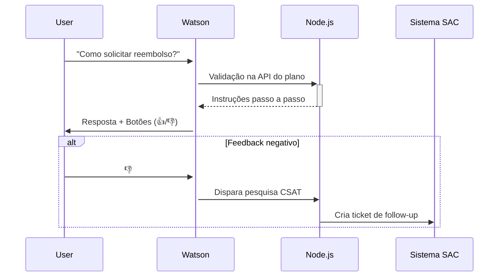

Para um sistema de pesquisa de satisfação integrado ao **IBM Watson Assistant** com backend em **Node.js** em um contexto de plano de saúde, recomendo a seguinte estrutura, métricas e fluxo de implementação:

---

### **Arquitetura Técnica Recomendada**
| **Camada**          | **Tecnologias/Recursos**                                                                 | **Função**                                                                 |
|---------------------|------------------------------------------------------------------------------------------|----------------------------------------------------------------------------|
| **Frontend**        | Web Chat do Watson Assistant (React/JS)                                                  | Interface de atendimento ao usuário                                        |
| **Orquestração**    | IBM Watson Assistant (Dialog Skills)                                                      | Processamento de NLU, gestão de diálogos                                   |
| **Backend**         | Node.js + Express                                                                        | Lógica de negócio, integrações com APIs de saúde                           |
| **Dados**           | IBM Cloudant (NoSQL) / PostgreSQL                                                        | Armazenamento de logs, métricas e feedbacks                               |
| **Análise**         | Watson NLP + Watson Studio                                                               | Análise de sentimento e mineração de tópicos                               |
| **Monitoramento**   | IBM Instana / Prometheus + Grafana                                                       | Dashboard de KPIs em tempo real                                            |

---

### **Dados Relevantes para Extrair do Watson Assistant**
1. **Metadados da Conversa:**
   ```json
   {
     "session_id": "a1b2c3d4",
     "timestamp": "2025-08-01T14:30:00Z",
     "intenção_principal": "solicitar_reembolso",
     "confiança_nlu": 0.92,
     "entidades": ["procedimento: ressonância magnética", "valor: R$ 1500,00"]
   }
   ```

2. **Indicadores de Desempenho:**
   - Taxa de reconhecimento de intenções (`intenções_confiança_baixa < 0.7`)
   - Número de voltas no diálogo (`contagem_mensagens`)
   - Tempo de resposta médio por mensagem (calculado via `timestamps`)

3. **Sinais de Insatisfação:**
   - Menções a palavras como "reclamação", "problema", "insatisfeito" (detectável com Watson NLP)
   - Mudança abrupta no *sentiment score* durante a conversa
   - Solicitações repetidas para "falar com humano"

---

### **KPIs Essenciais para Saúde**
| **Categoria**        | **KPI**                          | **Como Coletar**                                                                 |
|-----------------------|----------------------------------|----------------------------------------------------------------------------------|
| **Eficiência**        | Taxa de Resolução (FCR)          | `(total_conversas - escalonamentos) / total_conversas`                           |
| **Satisfação**        | CSAT do Atendimento              | Pesquisa pós-chat: *"De 1 a 5, como avalia este atendimento?"*                  |
| **Qualidade**         | NPS Temático                     | *"Você indicaria nosso plano para um amigo após esta experiência?"* (0-10)       |
| **Experiência**       | Customer Effort Score (CES)      | *"Foi fácil resolver sua questão?"* (Escala 1-7)                                |
| **Operacional**       | Custo por Interação              | `(custos_infra + custos_integrações) / total_conversas_mensal`                  |

---

### **Implementação Node.js para Coleta de Dados**
```javascript
// Middleware para captura de métricas
app.use('/webhook', async (req, res) => {
  const { session_id, message, context } = req.body;
  
  // Registrar métricas básicas
  await db.collection('chat_metrics').insertOne({
    session_id,
    intent: context.skills['main skill'].intent,
    confidence: context.skills['main skill'].confidence,
    user_id: context.metadata.user_id,
    timestamp: new Date()
  });

  // Detectar sentimento em tempo real
  const sentiment = await watsonNL.analyze({
    text: message.input.text,
    features: { sentiment: {} }
  });

  if(sentiment.document.score < -0.7) {
    // Acionar fluxo de emergência
    context.emergency = true;
  }
  
  // Próximo passo do diálogo
  res.json(context);
});
```

---

### **Análises Estratégicas com Watson Studio**
1. **Correlação de Reclamações:**
   ```python
   # Exemplo de análise no Watson Studio
   df.groupby('procedimento_medico')['insatisfacao'].mean().sort_values(ascending=False)
   ```
   - Identificar procedimentos com maior índice de insatisfação (ex.: reembolsos demorados)

2. **Segmentação por Perfil:**
   - Cruzar dados de satisfação com:
     - Faixa etária (idosos têm 2x mais dificuldade com autorizações)
     - Tipo de plano (cooperado vs. empresarial)
     - Região geográfica

---

### **Fluxo de Feedback com Watson Assistant**


---

### **Boas Práticas Específicas para Saúde**
1. **Conformidade:**
   - Anonimização de dados sensíveis com IBM Security Guardium
   - Logs de auditoria para rastreabilidade (LGPD/HIPAA)

2. **Integrações Críticas:**
   - Conexão com sistemas de autorizações via API REST
   - Validação de cobertura em tempo real

3. **Monitoramento Proativo:**
   ```bash
   # Alerta no Grafana para picos de insatisfação
   ALERT HighDissatisfaction
   IF rate(negative_feedbacks[5m]) > 0.5
   FOR 10m
   ```

---

### **Ferramentas Complementares**
- **Pesquisas:** IBM Survey Creator (integração nativa com Watson Assistant)
- **Logs:** IBM Log Analysis com query:
  ```sql
  SELECT * FROM chat_logs 
  WHERE intent = 'reclamacao_reembolso' 
  AND sentiment_score < -0.5 
  ORDER BY timestamp DESC
  ```
- **Dashboard:** Exemplo de métricas-chave:
  ```
  [ CSAT ]: 4.2 (82% acima de 4)
  [ FCR ]: 76% 
  [ Tópico Crítico ]: "Autorizações" (45% das reclamações)
  ```

Esta estrutura oferece uma base técnica robusta, com foco em dados acionáveis para melhorar tanto a experiência do usuário quanto a [[Eficiência Operacional]] no setor de saúde.